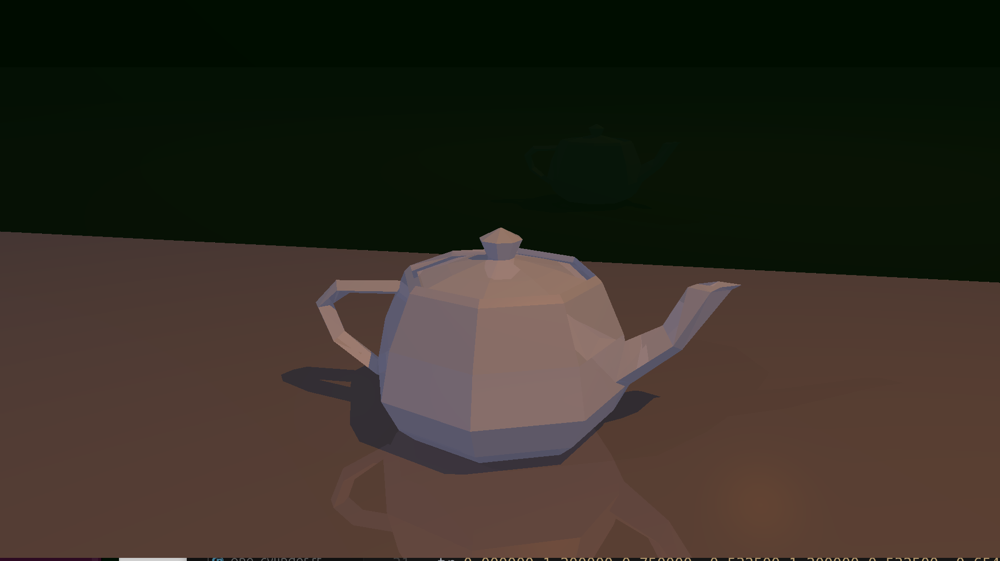
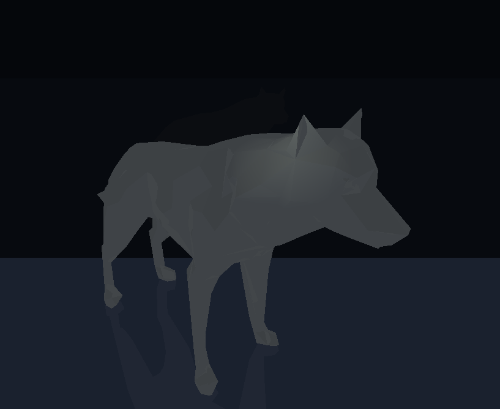
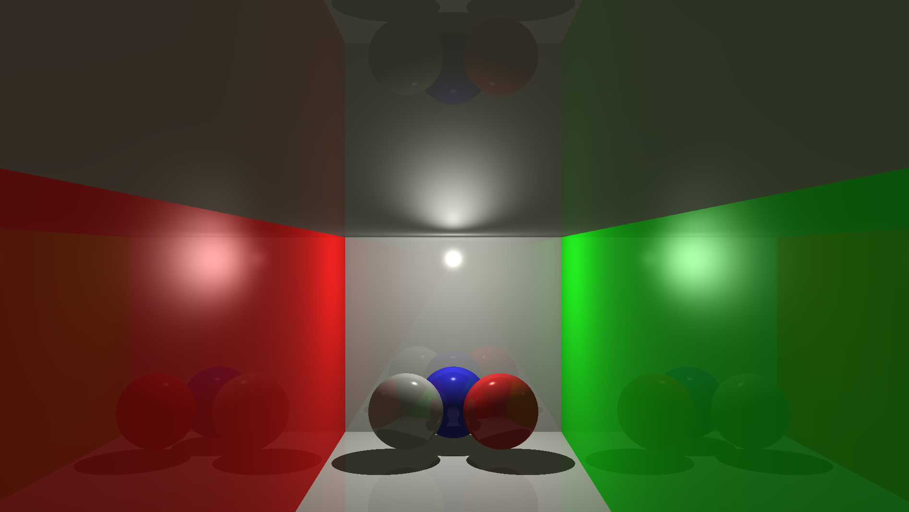
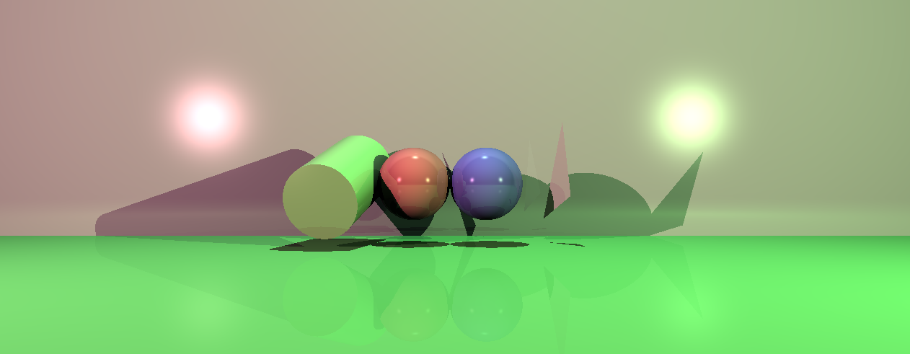
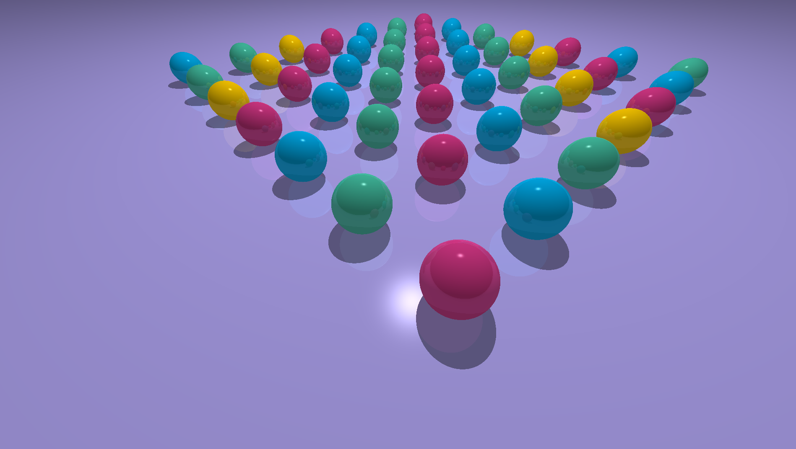
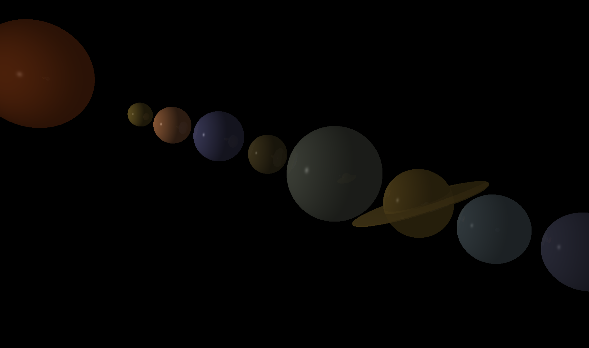
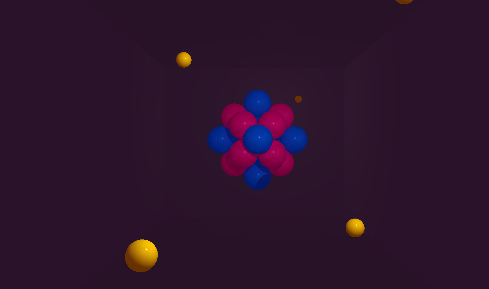
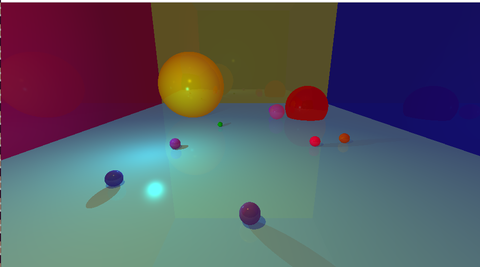
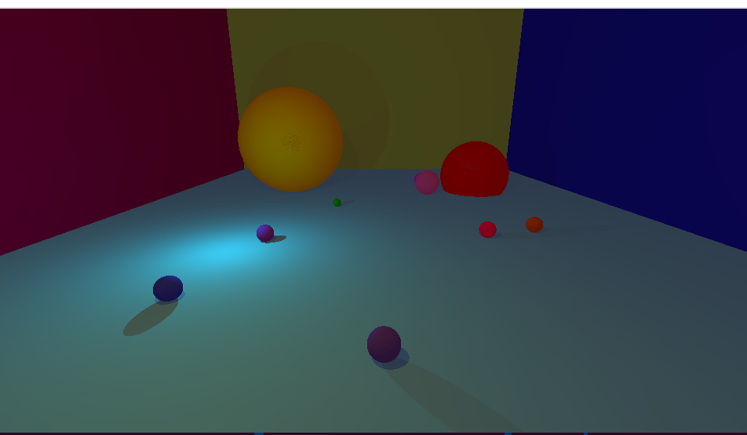

# miniRT - Ray Tracing Engine

3D ray tracer built in C with multi-threading support for parallel rendering.


## What I Built

- **Ray Tracing Engine**: Renders 3D scenes by casting rays from camera through pixels
- **Multi-Threading**: Added pthread support to render different image rows in parallel
- **Multiple Shapes**: Spheres, planes, cylinders, cones, triangles
- **Phong Lighting**: Ambient, diffuse, and specular lighting with shadows
- **Reflections**: Recursive ray casting for reflective surfaces

## Gallery

Here are some examples of scenes rendered with miniRT:


_A classic teapot scene._


_A more complex model, showcasing triangle mesh rendering._


_The Cornell Box, a standard test for ray tracers._


_A scene demonstrating all supported geometric primitives._


_A colorful scene with multiple spheres and reflections._


_A planetary scene with lighting and shadows._


_An abstract representation of an atom._


_A room scene with a bright light source._


_The same room scene with a dimmer, more atmospheric lighting._


_A majestic dragon, showcasing complex model rendering._

## Installation

### Prerequisites
- GCC or Clang compiler
- GNU Make
- X11 development libraries (Linux)
- MLX library

### Build
```bash
git clone --recursive git@github.com:tham-le/miniRT.git
cd miniRT
make
```

## Technical Implementation

```c
// Multi-threaded rendering structure
typedef struct s_thread_data {
    t_data *data;
    int    start_row;
    int    end_row;
    int    thread_id;
} t_thread_data;

// Optimized vector normalization
void fast_normalize_vec(t_vector *vec) {
    double mag_sq = vec_magnitude_squared(vec);
    if (mag_sq == 0) return;
    double inv_mag = 1.0 / sqrt(mag_sq);
    scale_vec(vec, vec, inv_mag);
}
```

## Usage

```bash
./miniRT scenes/one_sphere.rt
```

## Scene Format
```
A  0.2        255,255,255    # Ambient lighting
C  0,0,-5  0,0,1  70         # Camera
L  -40,50,0  0.8  255,255,255 # Light
sp 0,0,0   2      255,0,0    # Sphere
```

## Skills Used
- **C Programming** (8,000+ lines)
- **Multi-threading** (pthreads) 
- **3D Mathematics** (vectors, matrices, ray-object intersections)
- **Graphics Programming** (ray tracing algorithms)
- **Memory Management** (efficient data structures) 